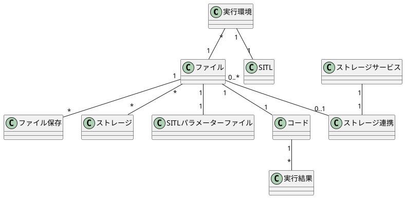
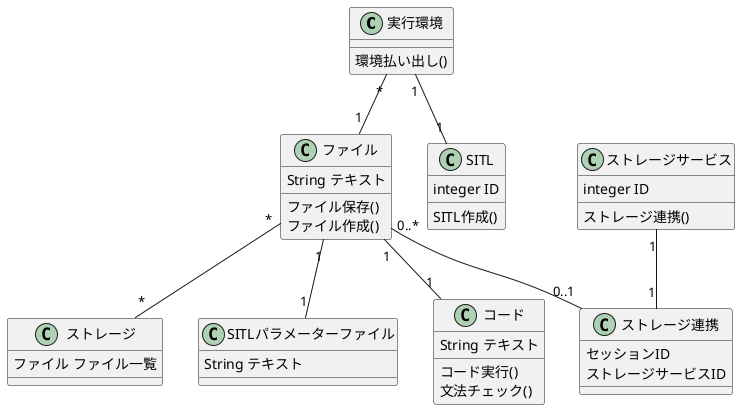
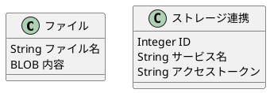
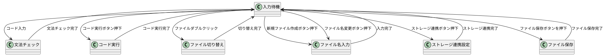
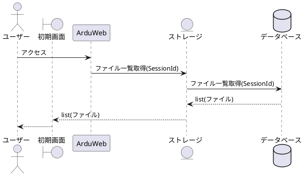
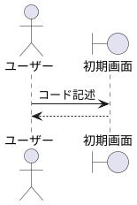
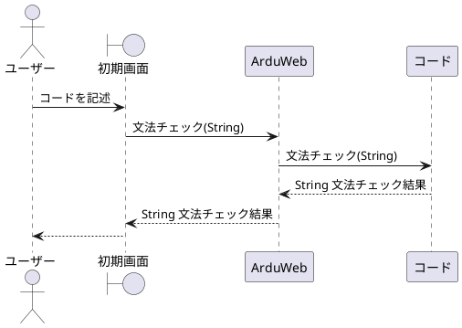

## システム概要
```
ArduPilotのシミュレーターであるSITLを実行できるWebサービス。
これによりSITLの環境構築を省略し手軽にArdupilotの動作確認を行うことができることを目的とする。
イメージとしてはJupyter NoteBook上でSITLを実行し、ドローンの状態を確認できるもの。
```

## ユースケース一覧
### サービスにアクセスする
* 概要
    * Webサービスにアクセスし、初期画面を表示する
* アクター
    * ユーザー
* 事前条件
    * ユーザーが対応のブラウザを用いてアクセスしていること
* 事後条件
    * 初期画面が表示されており、ストレージに保存されているファイルが表示されている
* 基本系列
    * 1 ユーザーはWebサービスにアクセスする
    * 2 システムはユーザーの所有するファイルを取得し、返却する
    * 3 初期画面が表示され、所有するファイルが表示される
* 代替系列
* 例外系列
    * 2.1 システムがファイルを取得できなかった場合エラーメッセージを表示する
* 備考
### コードを記述する
* 概要
    * コードペインにPythonコードもしくはテキストファイルを入力する。
* アクター
    * ユーザー
* 事前条件
    * 初期画面が入力待機状態もしくは文法チェック状態にあること
* 事後条件
    * 入力文字列がコードペインに表示されていること
* 基本系列
    * 1 ユーザーはコードペインを選択する
    * 2 ユーザーは文字列を入力する。
    * 3 コードペインに入力された文字列が表示される
* 代替系列
* 例外系列
* 備考
### コードを実行する
* 概要
    * 選択されたファイルのPythonコードを実行する
* アクター
    * ユーザー  
* 事前条件
    * 初期画面が入力待機状態にあること
* 事後条件
    * 入力待機状態にあること
    * 実行結果が出力されていること
* 基本系列
    * 1 ユーザーは実行したいファイルを選択する
    * 2 ユーザーはコード実行ボタンを押下する
    * 3 実行された結果が入力待機状態の初期画面に表示される
* 代替系列
* 例外系列
* 備考
### ファイルの保存
* 概要
    * 選択されたファイルを保存する
* アクター
    * ユーザー  
* 事前条件
    * 初期画面が入力待機状態もしくは文法チェック状態にあること
* 事後条件
    * 選択されたファイルが保存されていること
* 基本系列
    * 1 ユーザーは保存したいファイルを選択する
    * 2 ユーザーはファイル保存ボタンを押下を押下する
    * 3 選択されたファイルが保存される
* 代替系列
* 例外系列
    * 3.1 ストレージの空き容量がない場合入力待機状態の初期画面にエラーメッセージを表示する
* 備考
### ドローンのパラメーターを設定する
* 概要
    * SITLのパラメーターを設定する
* アクター
    * ユーザー
* 事前条件
    * 初期画面が入力待機状態もしくは文法チェック状態にあること
* 事後条件
    * 設定値が保存されていること
* 基本系列
    * 1 ユーザーはSITLのパラメーターファイルを開く
    * 2 ユーザーはSITLのパラメーターを記述する
    * 3 ユーザーはパラメーターファイルを保存し、設定値が保存される
* 代替系列
    * 1.1 SITLのパラメーターファイルが存在しない場合はファイルを作成する
* 例外系列
* 備考
### ドローンのステータスを確認する
* 概要
    * SITLのステータスを確認する
* アクター
    * ユーザー
* 事前条件
    * 初期画面が入力待機状態もしくは文法チェック状態にあること
    * SITLが稼働していること
* 事後条件
    * SITLのステータスが表示されていること
* 基本系列
    * 1 ユーザーは入力待機状態の初期画面上のSITLペインからSITLのステータスを確認する
* 代替系列
* 例外系列
    * 1.1 SITLと接続できない場合エラーメッセージを表示する
* 備考
### コードを文法チェックする
* 概要
    * コードペインのPythonコードを文法チェックする
* アクター
    * ユーザー
* 事前条件
    * 初期画面が入力待機状態であること
    * 拡張子が.pyであるファイルが選択されていること
* 事後条件
    * 文法チェックがあった場合、入力待機状態の初期画面にエラーメッセージを表示する
* 基本系列
    * 1 ユーザーはコードペインを選択する
    * 2 ユーザーは文字列を入力する。
    * 3 文字列が文法チェックされ、エラーが存在する場合結果が表示される
* 代替系列
    * 3.1 エラーがない場合は何も表示されない
* 例外系列
* 備考
### ファイルを作成する
* 概要
    * ファイルを作成する
* アクター
    * ユーザー
* 事前条件
    * 初期画面が入力待機状態もしくは文法チェック状態にあること
* 事後条件
    * 新規ファイルが作成されており、ファイルペインに表示されている
* 基本系列
    * 1 ユーザーはファイル作成ボタンを押下する
    * 2 ユーザーはファイル名を入力する
* 代替系列
* 例外系列
    * 2.1 ファイル名が入力されていない場合は'NewFile'と命名する
    * 2.1 ストレージの空き容量がない場合はエラーメッセージを表示する
* 備考
### 他のサービスのストレージと連携する
* 概要
    * 他のストレージサービスと連携し、ファイルを共有できるようにする
* アクター
    * ユーザー
* 事前条件
    * インターネットに接続できる
* 事後条件
    * ストレージサービスと連携し、ファイルペインに共有しているファイルが表示されている
* 基本系列
    * 1 ユーザーはストレージ連携ボタンを押下する
    * 2 ユーザーは連携設定を行う。
* 代替系列
    * 2.1 連携に失敗した場合は入力待機状態に遷移する
* 例外系列
* 備考
## ドメイン図

## クラス図

## ER図

## 画面状態遷移図


## シーケンス図
### サービスにアクセスする

### コードを記述する

### コードを実行する

### ファイルの保存

### ドローンのパラメーターを設定する
### ドローンのステータスを確認する
### コードを文法チェックする
### ファイルを作成する
### 他のサービスのストレージと連携する